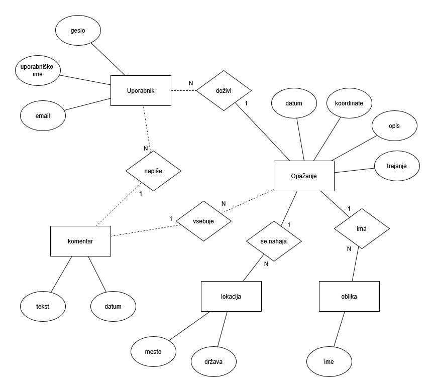

# Zbirka NLP

## Kratek opis

Projekt obsega spletno stran, ki predstavlja zbirko podatkov o opažanjih NLP-jev (neznanih letečih predmetov).
Na strani lahko uporabnik objavi svoja lastnoročna opažanja NLP-jev, ter lahko tudi vidi opažanja od drugih uporabnikov.

Stran torej dopušča registracijo in prijavo, in ko si prijavljen, lahko izpolniš nek obrazec o tvojem opažanju.
To opažanje se nato shrani v Postgresql podatkovni bazi, poleg drugih opažanj. Uporabnik lahko najde od drugih opažanja preko iskalnika na strani, in jih lahko komentira.

Začetni podatki za stran prihajajo s podatkovne zbirke s strani Kaggle. Ta vsebuje čez 80.000 zgodovinskih opažanj NLP-jev, in iz tam izhaja struktura, ki jo bomo uporabili za objekt opažanja.

## ER-diagram

## Vir podatkov
https://www.kaggle.com/datasets/NUFORC/ufo-sightings/data