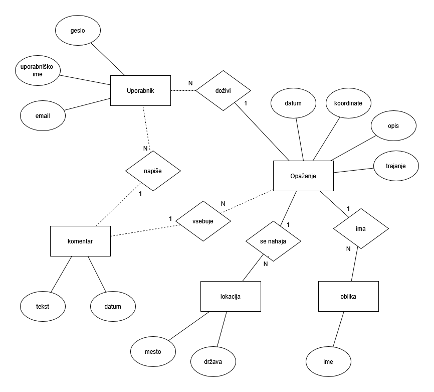

# Zbirka NLP

## Kratek opis

Projekt obsega spletno stran, ki predstavlja zbirko podatkov o opažanjih NLP-jev (neznanih letečih predmetov).
Na strani lahko uporabnik objavi svoja lastnoročna opažanja NLP-jev, ter lahko tudi vidi opažanja od drugih uporabnikov.

Stran torej dopušča registracijo in prijavo, in ko si prijavljen, lahko izpolniš nek obrazec o tvojem opažanju.
To opažanje se nato shrani v Postgresql podatkovni bazi, poleg drugih opažanj. Uporabnik lahko najde od drugih opažanja preko iskalnika na strani, in jih lahko komentira.

Začetni podatki za stran prihajajo s podatkovne zbirke s strani Kaggle. Ta vsebuje čez 80.000 zgodovinskih opažanj NLP-jev, in iz tam izhaja struktura, ki jo bomo uporabili za objekt opažanja.

## Navodila za uporabo
Preverjeno da deluje na Windows in Linux.
1. Kloniraj projekt v lokalno mapo z `git clone` ukazom
2. V mapi projekta (kjer se nahaja tudi `main.py`) ustvari novo Python virtualno okolje
3. Znotraj virtualnega okolja inštaliraj potrebne knjižnice z `pip install -r requirements.txt` (morda MacOS potrebuje drug psycopg2 tukaj)
4. Po želji dopolni `Data/auth.py`, drugače se bo projekt povezal na strežnik od fmf-ja. Za zgled lahko uporabiš `Data/auth_public.py`
5. Zaženi projekt znotraj virtualnega okolja z `python main.py`. Če je baza prazna, bi se ob prvem zagonu morala dopolniti s potrebnimi podatki

Bazo se da resetirati na prvotno stanje z ukazom `python main.py --clean`.

## ER-diagram

## Vir podatkov
https://www.kaggle.com/datasets/NUFORC/ufo-sightings/data
